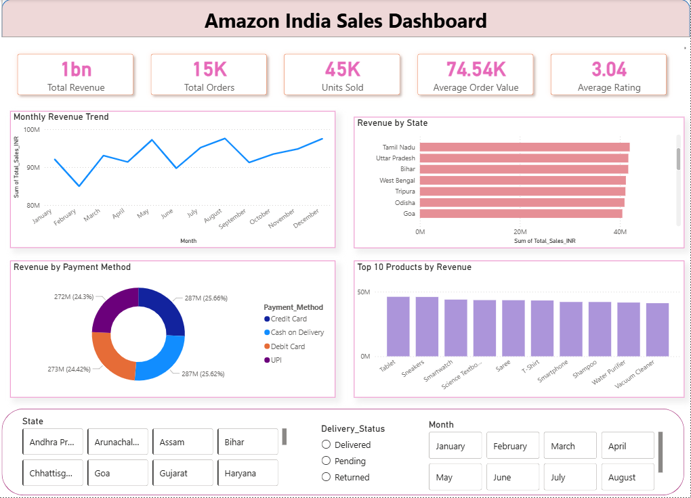

# amazon-sales-dashboard
Amazon India Sales Analysis Dashboard using Excel, SQL and Power BI

# Amazon India Sales Dashboard

## Project Overview
This project analyzes Amazon India sales data using Excel, SQL, and Power BI.

## Tools Used
- Excel
- SQL (MySQL)
- Power BI

## Key KPIs
- Total Revenue
- Total Orders
- Units Sold
- Average Order Value
- Average Rating

## Dashboard Features
- Monthly Revenue Trend
- Revenue by State
- Payment Method Analysis
- Top Products Analysis
- Interactive Filters!

## Files
- Amazon_Sales_Dashboard.pbix
- Amazon_Sales_SQL_Analysis.sql
- amazon_sales.csv

## Dashboard Preview

